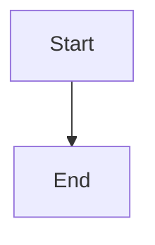

# Mermaid v11 升级说明

## 升级概述

本项目已成功从 Mermaid v10.6.0 升级到 v11.14.0，并适配了最新的语法规范。

## 主要变化

### 1. 依赖版本升级

```json
{
  "dependencies": {
    "mermaid": "^11.14.0"  // 从 ^10.6.0 升级
  }
}
```

### 2. 语法变更：flowchart 替代 graph

Mermaid 10+ 推荐使用 `flowchart` 关键字替代 `graph`，虽然 `graph` 仍然向后兼容，但新代码应使用 `flowchart`。

**旧语法（已弃用但不报错）**:


**新语法（推荐）**:


### 3. 代码适配

#### mermaidSerializer.ts

添加了 `diagramType` 配置选项：

```typescript
export interface MermaidConfig {
  direction: 'TB' | 'LR' | 'BT' | 'RL';
  theme: 'default' | 'dark' | 'forest' | 'neutral' | 'base';
  handDrawn: boolean;
  curveStyle: string;
  diagramType?: 'graph' | 'flowchart';  // 新增
}
```

序列化函数现在默认使用 `flowchart`：

```typescript
const diagramType = config.diagramType || 'flowchart';
let mermaidCode = `${diagramType} ${config.direction}\n`;
```

#### App.tsx

更新默认配置：

```typescript
const [config] = useState<MermaidConfig>({
  direction: 'TB',
  theme: 'default',
  handDrawn: false,
  curveStyle: 'basis',
  diagramType: 'flowchart',  // 新增
});
```

## 兼容性说明

### 向后兼容

- ✅ 现有的 `graph` 语法文件仍然可以正常打开和编辑
- ✅ 解析器同时支持 `graph` 和 `flowchart` 关键字
- ✅ 所有现有功能保持不变

### 新生成代码

- ✅ 新创建的流程图默认使用 `flowchart` 语法
- ✅ 符合 Mermaid 官方推荐实践
- ✅ 更好的未来兼容性

## Mermaid 11.x 新特性

### 1. 改进的渲染性能

Mermaid 11.x 使用了更新的渲染引擎，提供更快的图表生成速度。

### 2. 更好的错误处理

改进了语法错误的检测和提示，帮助用户更快定位问题。

### 3. 增强的主题支持

支持更多自定义主题选项，与 VS Code 主题集成更紧密。

### 4. 新的图表类型支持

- 更完善的 C4 图支持
- 改进的 Git 图
- 增强的时间线图

## 测试验证

### 流程图测试

打开以下文件验证 flowchart 语法：

```bash
tests/test-flowchart.mmd
example-flowchart.mmd
```

预期行为：
- 文件正常打开
- 可视化编辑器正常显示
- 保存时使用 `flowchart` 语法

### ER 图测试

```bash
tests/test-er.mmd
```

预期行为：
- 文件正常打开
- 显示原始代码预览
- 内容不被修改

### 序列图测试

```bash
tests/test-sequence.mmd
```

预期行为：
- 文件正常打开
- 显示原始代码预览
- 内容不被修改

## 迁移指南

### 对于现有用户

无需任何操作，插件会自动处理：
- 旧的 `graph` 文件继续正常工作
- 新保存的文件自动使用 `flowchart` 语法

### 对于开发者

如果需要强制使用 `graph` 语法（不推荐）：

```typescript
const config: MermaidConfig = {
  // ... 其他配置
  diagramType: 'graph',  // 显式指定
};
```

## 已知问题

### 1. 大型图表性能

Mermaid 11.x 对大型图表（100+ 节点）的渲染性能有所提升，但仍建议在复杂场景下考虑分页或简化。

### 2. 自定义样式

部分高级自定义样式可能需要调整以适配新版本的 CSS 选择器。

## 参考资源

- [Mermaid 官方文档](https://mermaid.js.org/)
- [Mermaid 11 发布说明](https://github.com/mermaid-js/mermaid/releases)
- [Flowchart vs Graph](https://mermaid.js.org/syntax/flowchart.html)

## 总结

此次升级确保了项目与 Mermaid 最新版本的兼容性，同时采用了推荐的 `flowchart` 语法，为未来的功能扩展打下良好基础。所有现有功能保持完整，用户体验不受影响。

---

*最后更新: 2026-05-10*
*Mermaid 版本: v11.14.0*
