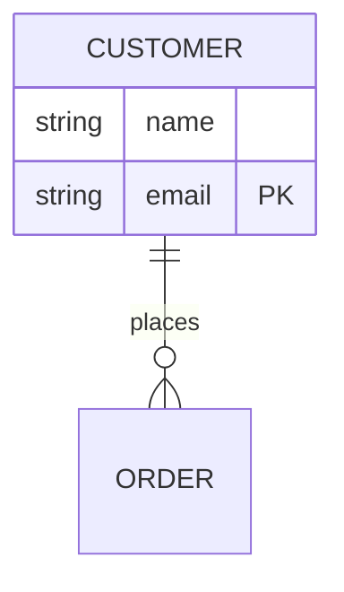
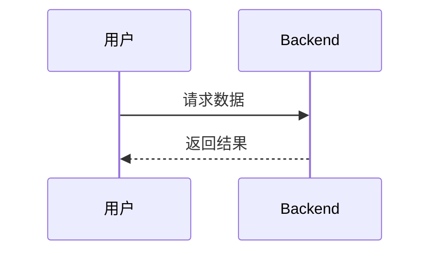

# 架构重构进度更新

## 最新进展 (2026-05-10)

### 已完成功能

#### 1. ER 图解析器完善
- ✅ 实现实体定义解析（支持属性列表）
- ✅ 实现关系解析（一对一、一对多、多对多）
- ✅ 支持主键（PK）和外键（FK）标识
- ✅ 支持注释和标签提取

**测试文件**: `tests/test-er.mmd`

#### 2. 序列图解析器完善
- ✅ 实现参与者解析（支持 alias）
- ✅ 实现消息解析（实线/虚线箭头）
- ✅ 支持注释（Note over）
- ✅ 维护参与者映射关系

**测试文件**: `tests/test-sequence.mmd`

#### 3. UI 改进
- ✅ 在工具栏显示当前检测到的图表类型
- ✅ 自适应主题颜色
- ✅ 实时反映图表类型变化

### 当前状态

| 组件 | 状态 | 说明 |
|------|------|------|
| DiagramRegistry | ✅ 完成 | 注册表和管理系统 |
| FlowchartHandler | ✅ 完成 | 完全支持可视化编辑 |
| ERDiagramHandler | ✅ 解析完成 | 解析和序列化已实现，编辑器待完善 |
| SequenceDiagramHandler | ✅ 解析完成 | 解析和序列化已实现，编辑器待完善 |
| 类型检测 | ✅ 完成 | 自动检测 3 种图表类型 |
| 内容保留 | ✅ 完成 | 不支持的类型保留原始代码 |

### 技术细节

#### ER 图解析示例

输入：


解析结果：
```typescript
{
  entities: [
    {
      id: 'entity-1',
      name: 'CUSTOMER',
      attributes: [
        { type: 'string', name: 'name' },
        { type: 'string', name: 'email', isPrimaryKey: true }
      ]
    }
  ],
  relationships: [
    {
      sourceEntity: 'CUSTOMER',
      targetEntity: 'ORDER',
      relationshipType: 'one-to-many',
      label: 'places'
    }
  ]
}
```

#### 序列图解析示例

输入：


解析结果：
```typescript
{
  participants: [
    { id: 'participant-1', name: 'User', alias: '用户' }
  ],
  messages: [
    { from: 'participant-1', to: 'Backend', message: '请求数据', type: 'solid' },
    { from: 'Backend', to: 'participant-1', message: '返回结果', type: 'dashed' }
  ]
}
```

### 下一步计划

#### 短期（本周）
1. 为 ER 图创建简单的表单编辑器
2. 为序列图创建简单的表单编辑器
3. 测试解析器的边界情况

#### 中期（1-2 周）
1. 添加类图支持（classDiagram）
2. 添加状态图支持（stateDiagram）
3. 优化解析错误处理

#### 长期
1. 实现 ER 图的可视化节点编辑
2. 实现序列图的时间轴编辑
3. 集成 ElkJS 布局引擎

### 已知问题

1. **ER 图编辑器**: 目前仅支持代码预览，需要实现可视化编辑界面
2. **序列图编辑器**: 目前仅支持代码预览，需要实现可视化编辑界面
3. **复杂关系**: ER 图的递归关系可能需要特殊处理

### 测试建议

使用以下测试文件验证功能：

```bash
# ER 图测试
tests/test-er.mmd

# 序列图测试
tests/test-sequence.mmd

# 流程图测试（确保向后兼容）
tests/test-flowchart.mmd
example-flowchart.mmd
```

### 编译状态

```
✅ TypeScript 编译成功
✅ Webpack 打包成功
✅ 无 lint 错误
```

### 分支信息

- **分支**: `refactor-diagram-architecture`
- **提交数**: 4 commits
- **最新提交**: 5eaeb764

---

*最后更新: 2026-05-10*
