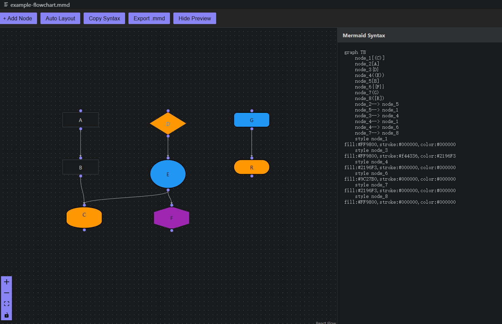
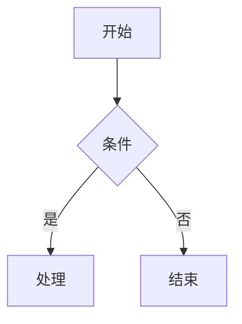

# Mermaid 可视化编辑器 for VSCode

[](https://marketplace.visualstudio.com/items?itemName=PUITO.mermaid-visual-editor-vscode)
[](https://marketplace.visualstudio.com/items?itemName=PUITO.mermaid-visual-editor-vscode)
[](https://marketplace.visualstudio.com/items?itemName=PUITO.mermaid-visual-editor-vscode)
[](https://github.com/PUITO/mermaid-visual-editor-vscode)

一个 Visual Studio Code 扩展，为 Mermaid (.mmd) 文件提供可视化的拖拽编辑器，具有交互式图表编辑功能。

**🔗 仓库**: [https://github.com/PUITO/mermaid-visual-editor-vscode](https://github.com/PUITO/mermaid-visual-editor-vscode)

**灵感来源**: [Mermaid Visual Editor](https://github.com/saketkattu/mermaid-visual-editor) - 一个独立的基于 Web 的 Mermaid.js 流程图可视化编辑器。

## 功能特性

- 🎨 **可视化拖拽编辑器**：使用直观的可视化画布创建和编辑 Mermaid 图表，支持拖拽交互
- 👁️ **实时预览**：在可视化构建时实时渲染 Mermaid 图表
- 🌓 **完整的 VSCode 主题支持**：自动适配您的 VSCode 主题（浅色/深色/高对比度）
- 🔗 **交互式画布**：无限画布，支持平移、缩放和节点连接手柄
- 📐 **自动布局**：使用 Dagre 布局算法自动排列节点
- 💡 **多种节点形状**：支持各种节点形状（矩形、圆角、体育场形、菱形、圆形、六边形、圆柱形等）
- 🎯 **边线自定义**：不同的边线类型（实线、虚线、粗线）并支持箭头
- 📤 **导出选项**：将图表导出为 .mmd 文件或复制 Mermaid 语法到剪贴板
- 🔄 **双向同步**：可视化编辑器中的更改会更新文档，反之亦然
- ⌨️ **键盘快捷键**：
  - `N` - 添加新节点
  - `Delete/Backspace` - 删除选中的节点/边线
  - 双击画布 - 添加节点
  - 双击节点 - 编辑标签

## 界面效果



*Mermaid 可视化编辑器界面展示*

### 主要功能演示

- **拖拽式节点编辑**：直观地创建和连接流程图节点
- **实时预览**：左侧编辑，右侧实时渲染 Mermaid 图表
- **主题适配**：自动跟随 VSCode 主题（浅色/深色/高对比度）
- **多种节点形状**：支持矩形、圆角、菱形、圆形等多种形状
- **智能布局**：一键自动排列节点位置

## Markdown 文件中嵌入 Mermaid 图表

如果您需要在 Markdown 文件中嵌入 Mermaid 图表并渲染为图片，可以使用以下方法：

### 方法一：使用 Markdown Preview Enhanced 插件（推荐）

**安装插件：**
- [Markdown Preview Enhanced](https://marketplace.visualstudio.com/items?itemName=shd101wyy.markdown-preview-enhanced)

**嵌入语法：**

```markdown
<!-- @import "./diagram.mermaid" {class="mermaid"} -->
```

**重要说明：**
- `.mmd` 文件：仅作为代码文件存储，不会自动渲染为图片
- `.mermaid` 文件：可以被 Markdown Preview Enhanced 识别并渲染为图表
- 必须使用 `<!-- @import "..." {class="mermaid"} -->` 语法才能正确渲染
- 旧的 `<!-- mmd: ... -->` 语法不被支持

**示例：**

```markdown
# 我的文档

这是一个流程图：

<!-- @import "./test-graph.mermaid" {class="mermaid"} -->

这是另一个图表：

<!-- @import "./flowchart.mermaid" {class="mermaid"} -->
```

### 方法二：直接使用 Mermaid 代码块

```markdown

```

这种方式会在支持 Mermaid 的 Markdown 预览中直接渲染图表。

---

## 支持的图表类型

目前专注于**流程图**，更多图表类型计划中：
- 流程图（✅ 已支持）
- 时序图（🔜 即将推出）
- 类图（🔜 即将推出）
- 状态图（🔜 即将推出）
- 实体关系图（🔜 即将推出）
- 以及更多...

## 使用方法

1. **打开 Mermaid 文件**
   - 在 VSCode 中打开任何 `.mmd` 或 `.mermaid` 文件
   - 可视化编辑器将自动以分屏视图打开

2. **主题支持** 🌓
   - 编辑器自动适配您的 VSCode 主题
   - 使用 `Ctrl+K Ctrl+T`（Mac: `Cmd+K Cmd+T`）切换主题
   - 支持浅色、深色和高对比度主题
   - Mermaid 图表根据 VSCode 主题使用相应的主题（默认/深色）
   - 详见 [THEME_SUPPORT.md](./THEME_SUPPORT.md)

3. **创建节点**
   - 点击工具栏中的 "+ 添加节点" 按钮
   - 按 `N` 键
   - 在画布任意位置双击

4. **连接节点**
   - 从一个节点的手柄（上/下/左/右）拖拽到另一个节点
   - 边线会自动创建

5. **编辑节点**
   - 双击节点以 inline 方式编辑其标签
   - 拖拽节点以重新定位

6. **自定义外观**
   - 选择节点以更改形状和样式（即将推出）
   - 自定义边线类型和标签（即将推出）

7. **自动布局**
   - 点击 "自动布局" 以自动排列节点
   - 选择方向：从上到下、从左到右等（即将推出）

8. **导出**
   - 点击 "复制语法" 将 Mermaid 代码复制到剪贴板
   - 点击 "导出 .mmd" 下载为 .mmd 文件
   - 切换预览面板以查看生成的语法

## 命令

- `Mermaid: 打开 Mermaid 可视化编辑器` - 为当前文件打开可视化编辑器
- `Mermaid: 切换预览` - 切换预览面板

## 安装

### 从 VSCode 市场安装（推荐）

1. 打开 VSCode
2. 进入扩展视图（`Ctrl+Shift+X` 或 `Cmd+Shift+X`）
3. 搜索 "Mermaid Visual Editor" 或访问：[市场链接](https://marketplace.visualstudio.com/items?itemName=PUITO.mermaid-visual-editor-vscode)
4. 点击安装

### 从 Open VSX 注册表安装

适用于 VSCodium 和其他开源编辑器：
1. 访问 [Open VSX](https://open-vsx.org/)
2. 搜索 "Mermaid Visual Editor"
3. 从扩展页面安装

### 手动安装（离线）

如果需要从 `.vsix` 文件安装：

1. 从 [GitHub Releases](https://github.com/PUITO/mermaid-visual-editor-vscode/releases) 下载最新的 `.vsix` 文件
2. 在 VSCode 中，进入扩展视图
3. 点击右上角的 "..." 菜单
4. 选择 "从 VSIX 安装..."
5. 选择下载的 `.vsix` 文件

## 开发与贡献

详见 [PUBLISHING.md](./PUBLISHING.md) 了解详细的发布流程和 GitHub Actions 配置。

### 本地开发

```bash
# 克隆仓库
git clone https://github.com/PUITO/mermaid-visual-editor-vscode.git
cd mermaid-visual-editor-vscode

# 安装依赖
npm install

# 编译 TypeScript 并构建 webview
npm run compile

# 以开发模式运行（在 VSCode 中按 F5）
# 或监视更改
npm run watch
npm run watch:webview
```

### 构建发布版本

```bash
# 编译并打包
npm run compile
npx vsce package

# 这将生成：mermaid-visual-editor-vscode-X.X.X.vsix
```

### 使用 GitHub Actions 自动发布

本项目使用 GitHub Actions 进行自动发布：

1. **CI 流水线**：每次推送/PR 时自动构建和测试
2. **发布流水线**：推送版本标签时发布到 VSCode 市场和 Open VSX

触发发布：
```bash
# 更新 package.json 中的版本
# 提交更改
git add package.json
git commit -m "Bump version to X.X.X"

# 创建并推送标签
git tag vX.X.X
git push origin vX.X.X
```

GitHub Actions 将自动：
- ✅ 构建项目
- ✅ 打包为 VSIX
- ✅ 创建包含 VSIX 下载的 GitHub Release
- ✅ 发布到 VSCode 市场
- ✅ 发布到 Open VSX 注册表

详见 [PUBLISHING.md](./PUBLISHING.md) 获取完整的设置说明。

## 要求

- VSCode 1.85.0 或更高版本

## 扩展设置

此扩展贡献：

- `.mmd` 和 `.mermaid` 文件的自定义编辑器
- Mermaid 语法的语言支持
- 工具栏集成

## 技术栈

此 VSCode 扩展使用以下技术构建：
- **React** - UI 框架
- **React Flow (@xyflow/react)** - 交互式图表/画布库
- **Zustand** - 状态管理
- **Dagre** - 图布局算法
- **Mermaid.js** - 图表渲染引擎
- **TypeScript** - 类型安全
- **Webpack** - 模块打包

## 已知问题

- 导入现有复杂 Mermaid 图表的功能仍在改进中
- 一些高级 Mermaid 功能（子图、特殊样式）尚未支持
- 复杂 Mermaid 语法的解析器已简化

请在我们的 GitHub 仓库报告任何问题。

## 路线图

### 短期
- ✅ 可视化拖拽编辑器（已实现）
- ✅ 使用 Dagre 的自动布局（已实现）
- ✅ 多种节点形状（已实现）
- 改进 Mermaid 语法解析器以导入复杂图表
- 子图支持
- 更多节点和边线的自定义选项

### 中期
- 时序图支持
- 类图支持
- 状态图支持
- ER 图支持
- 编辑器 UI 的主题选择器
- 深色模式支持

### 长期
- AI 辅助图表生成
- 代码-画布双向同步改进
- 实时协作功能

## 发布说明

### 1.0.0

- 支持多种图表类型（流程图、时序图、类图、状态图、ER图等）
- 双栏编辑器：可视化编辑 + Mermaid 代码实时同步
- Open in Editor 功能：一键在 VS Code 原生编辑器中打开
- 完整的主题适配：自动跟随 VS Code 主题
- 改进的解析器和序列化器，保持符号完整性
- Markdown 文件嵌入支持：使用 MPE 插件渲染外部图表

### 0.0.1

- 初始发布
- 流程图的可视化拖拽编辑器
- 带有 Mermaid 语法生成的实时预览
- 自动布局功能
- 导出为 .mmd 和复制语法功能
- 键盘快捷键支持
- 多种节点形状支持

## 许可证

MIT

## 致谢

本项目深受以下优秀作品的启发并基于其构建：

- **[Mermaid Visual Editor](https://github.com/saketkattu/mermaid-visual-editor)** by Saket Kattu
  - 可视化拖拽 Mermaid 编辑器的原始概念和实现
  - 画布状态管理和 Mermaid 序列化的架构模式
  - 此 VSCode 扩展为该作品在 VSCode 生态系统中的适配和扩展

特别感谢以下项目的创建者和贡献者：
- [Mermaid.js](https://mermaid.js.org/)
- [React Flow](https://reactflow.dev/)
- [Dagre](https://github.com/dagrejs/dagre)

---

**注意**：这是独立 Mermaid Visual Editor Web 应用程序的 VSCode 扩展适配版本。所有核心概念和实现模式均源自原始项目。
