# 多图表类型综合测试

本文件包含所有支持的图表类型测试用例。

## 1. Flowchart（流程图）- React Flow 可视化编辑

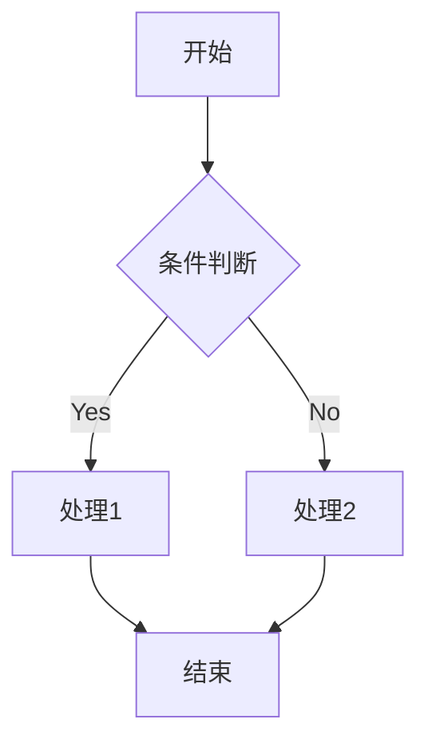

## 2. ER Diagram（实体关系图）- 表单编辑器

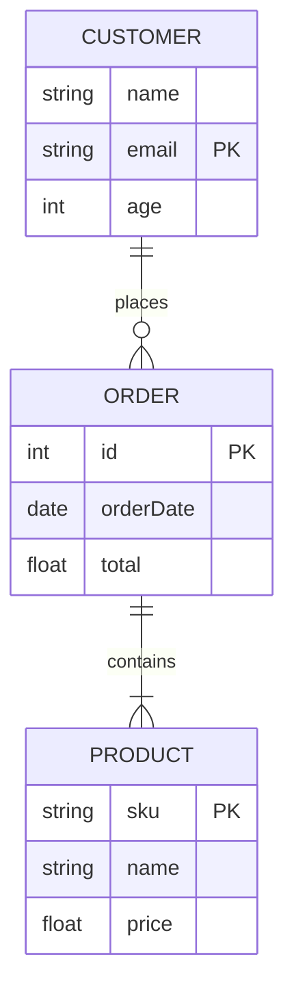

## 3. Sequence Diagram（序列图）- 表单编辑器

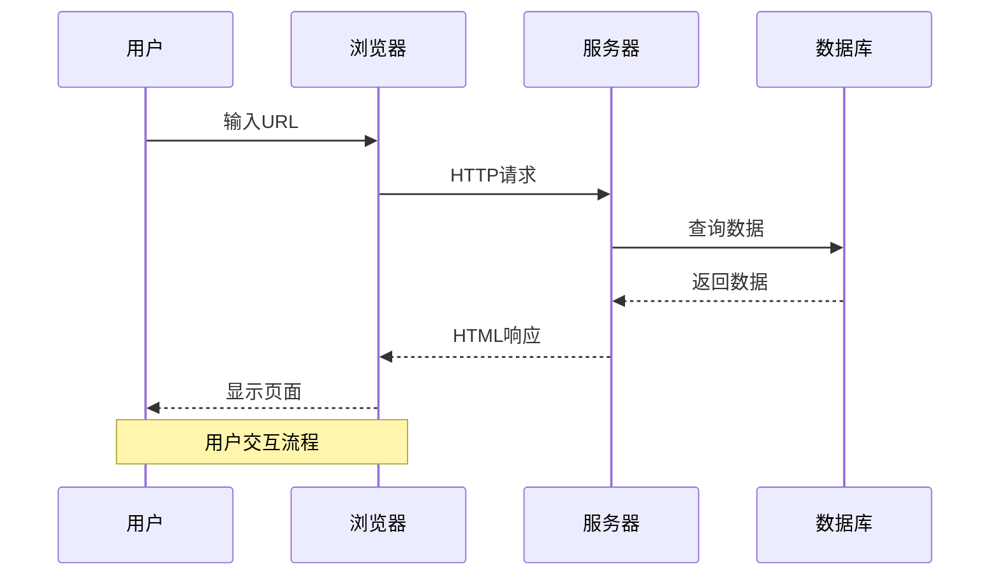

## 4. Class Diagram（类图）- 代码预览

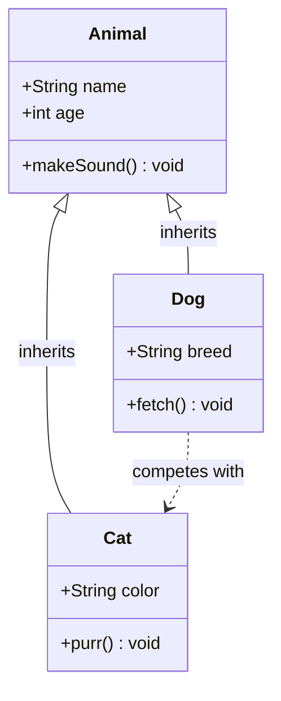

## 5. State Diagram（状态图）- 代码预览

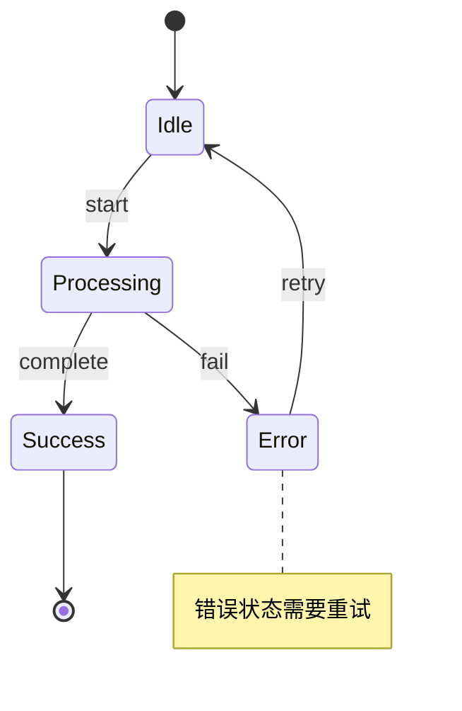

## 6. Complex Flowchart（复杂流程图）

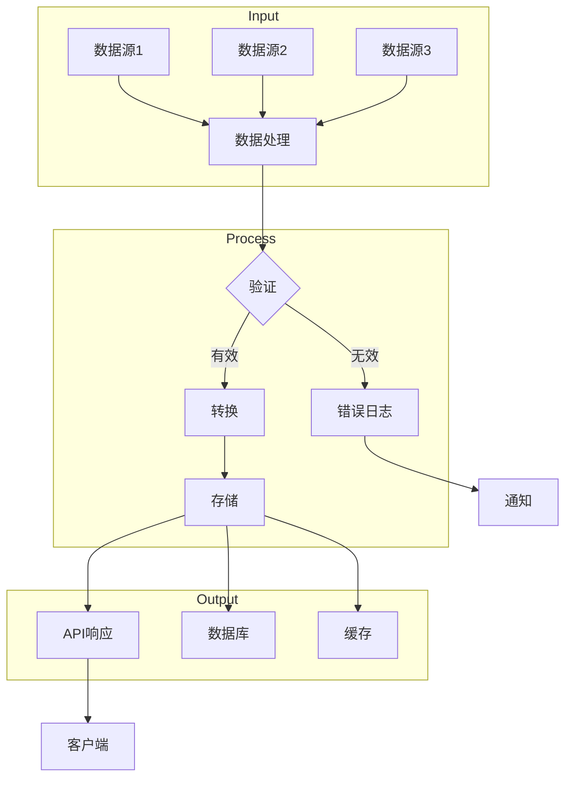

## 7. Advanced ER Diagram（高级ER图）

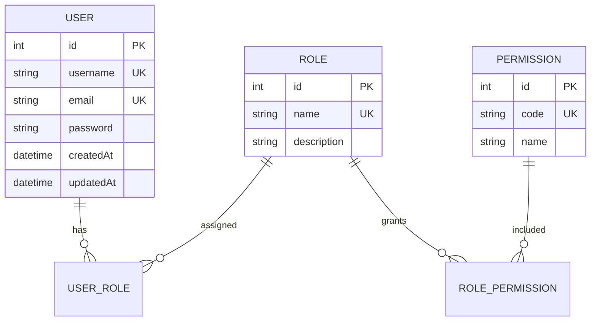

## 8. Complex Sequence Diagram（复杂序列图）

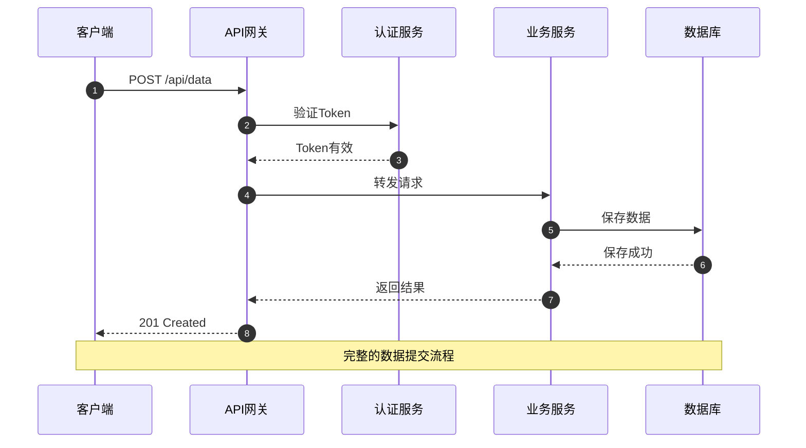

## 9. Inheritance Class Diagram（继承类图）

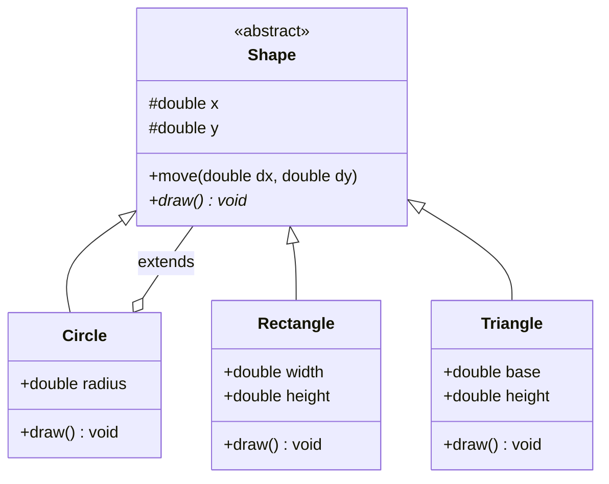

## 10. State Machine（状态机）

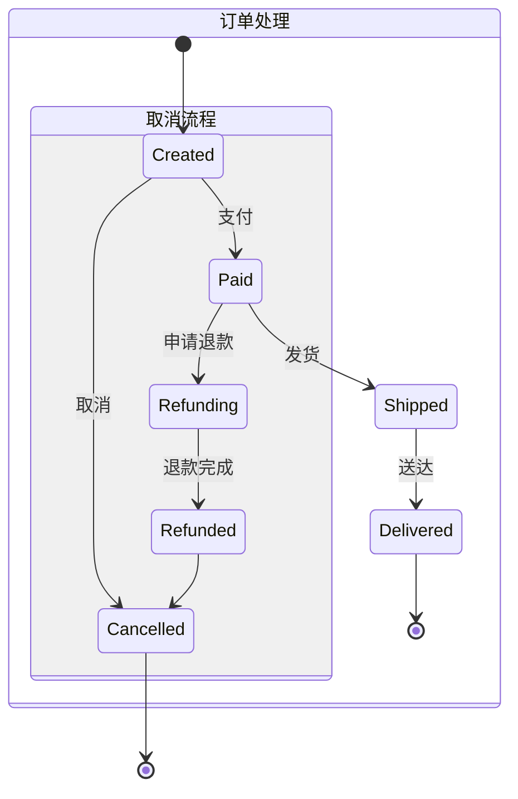

## 11. Gantt Chart（甘特图）- 代码预览

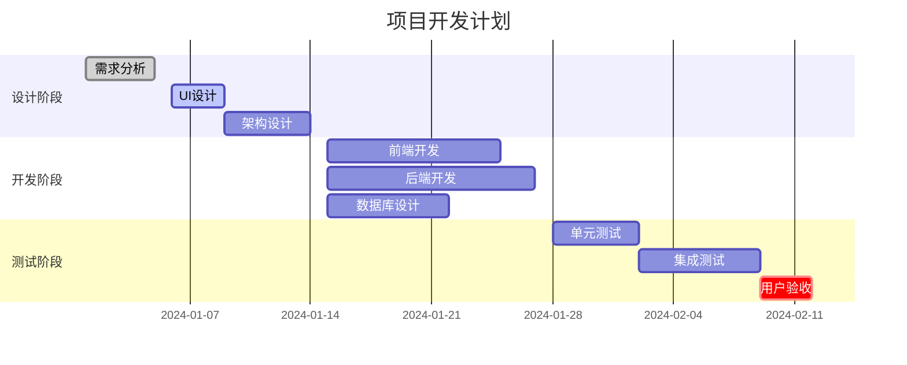

## 12. Pie Chart（饼图）- 代码预览

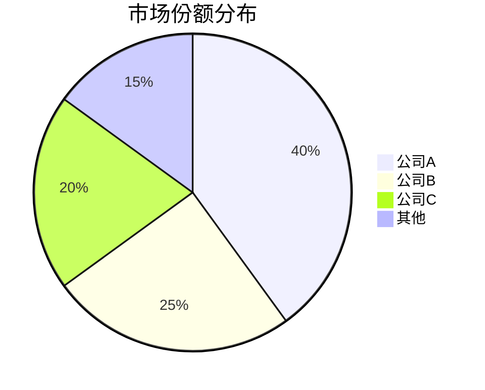

## 13. Advanced Pie Chart（高级饼图）

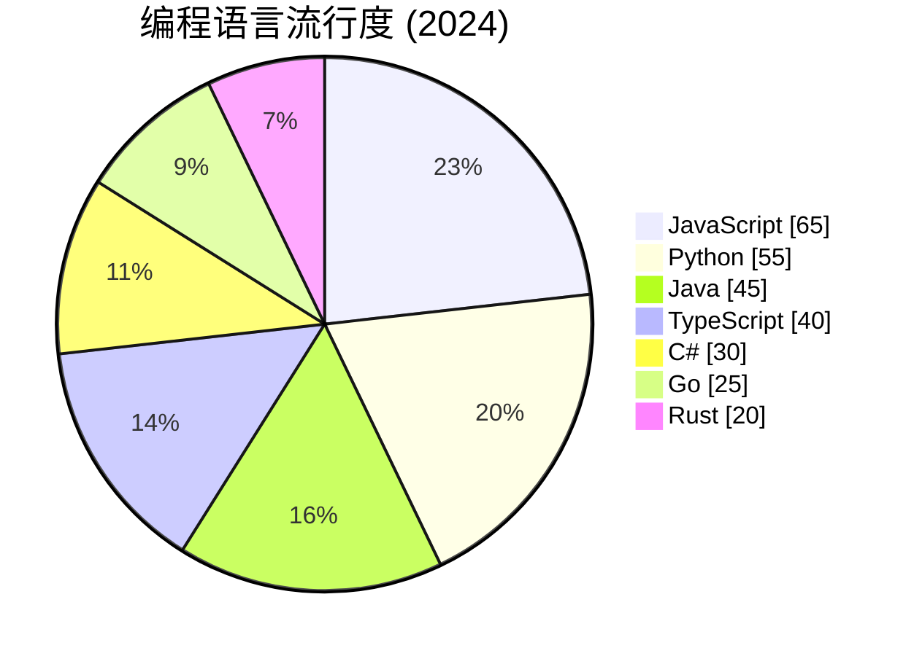

## 使用说明

1. **流程图**：支持 React Flow 可视化拖拽编辑，自动布局
2. **ER 图**：使用表单编辑器管理实体、属性、关系
3. **序列图**：使用表单编辑器管理参与者、消息流、注释
4. **类图**：目前仅支持代码预览和编辑
5. **状态图**：目前仅支持代码预览和编辑
6. **甘特图**：目前仅支持代码预览和编辑
7. **饼图**：目前仅支持代码预览和编辑

所有图表类型都支持：
- 自动检测图表类型
- 双向同步（代码 ↔ 编辑器）
- 保留原始格式
- Mermaid v11.14.0 语法
