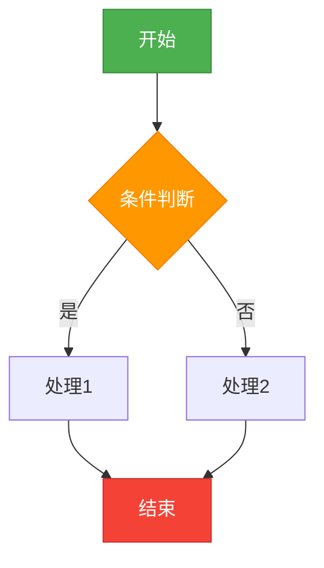
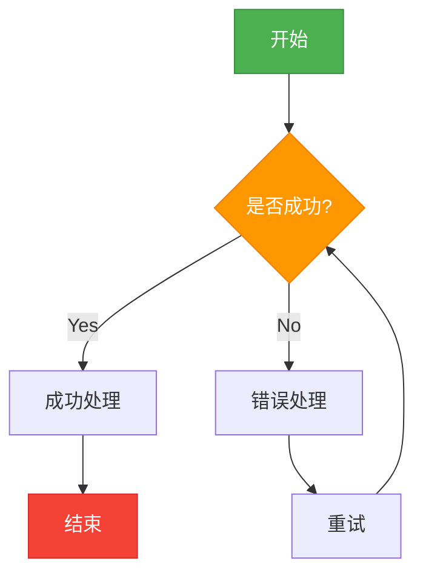
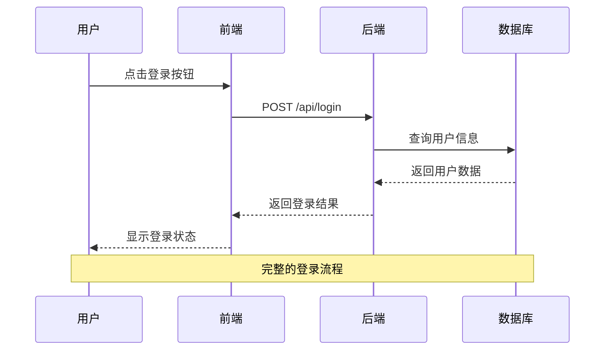
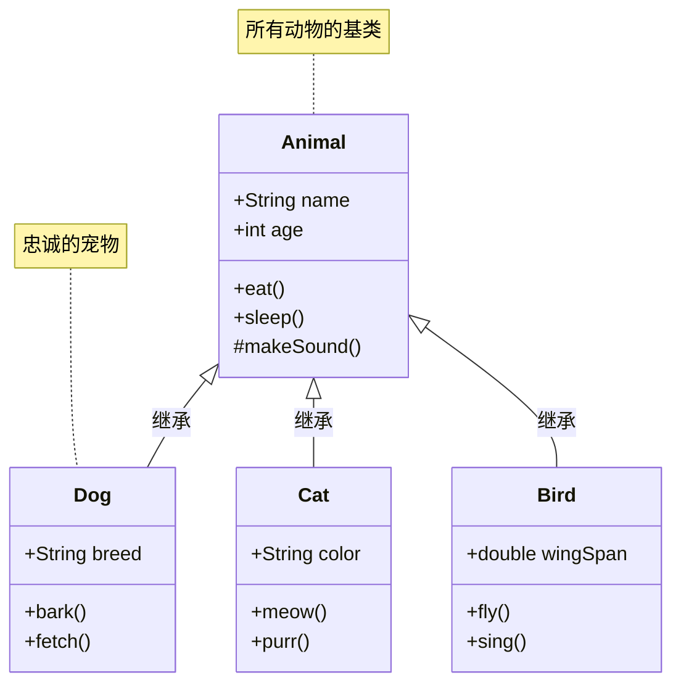
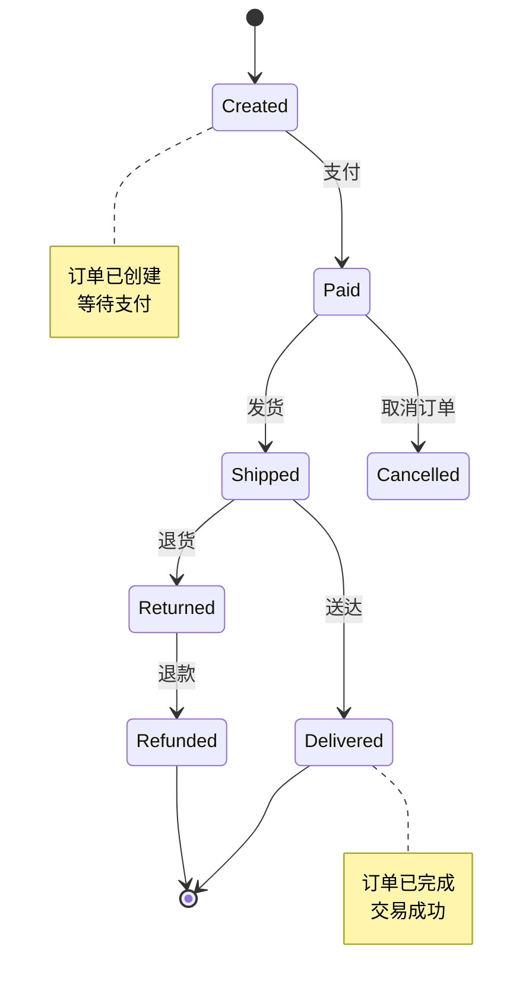
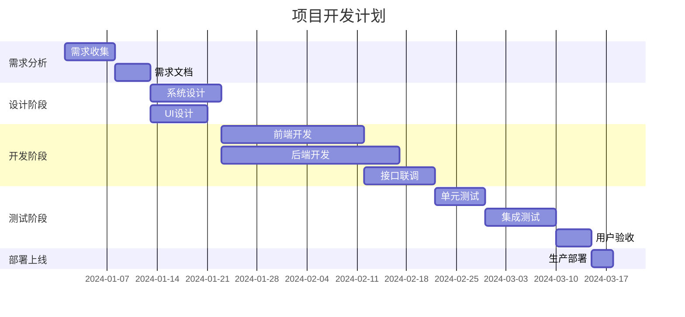
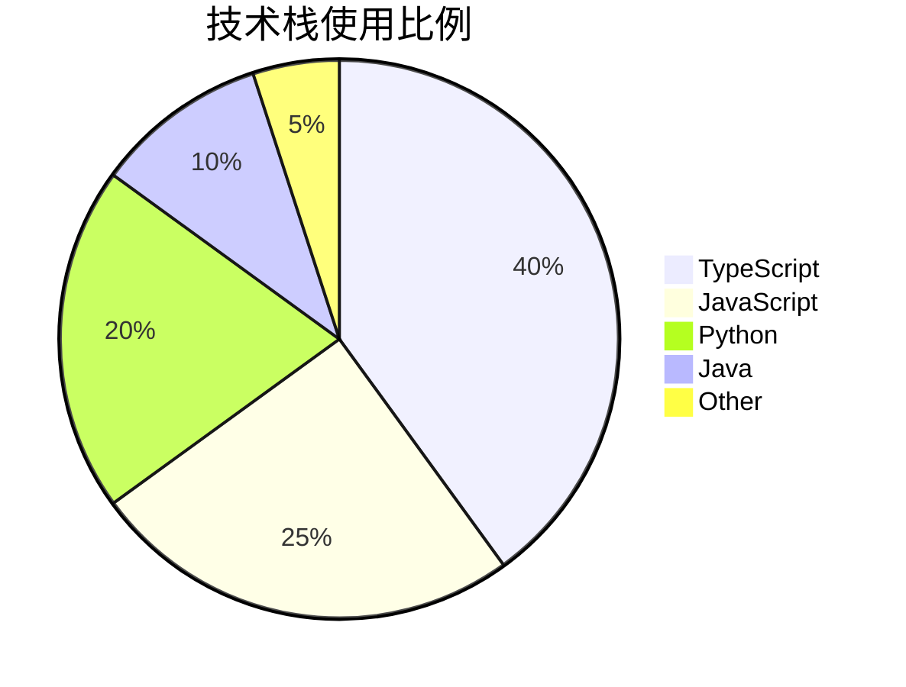
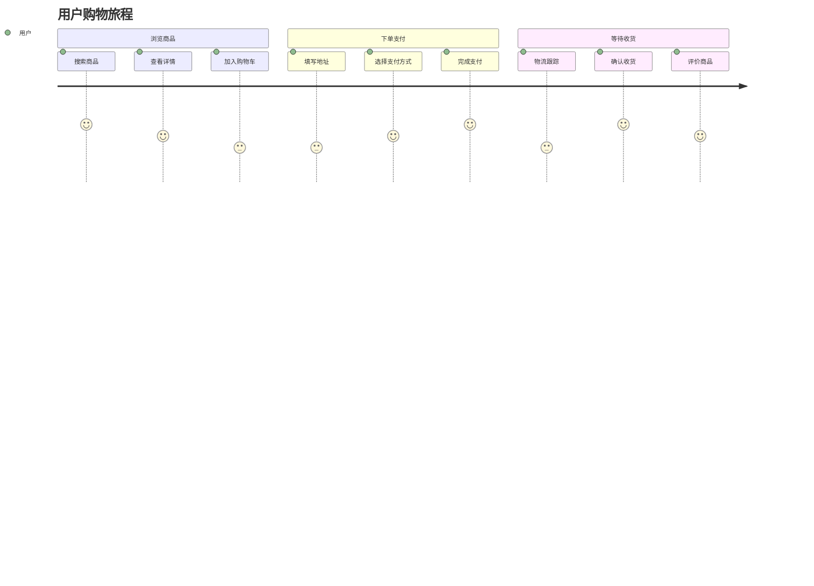
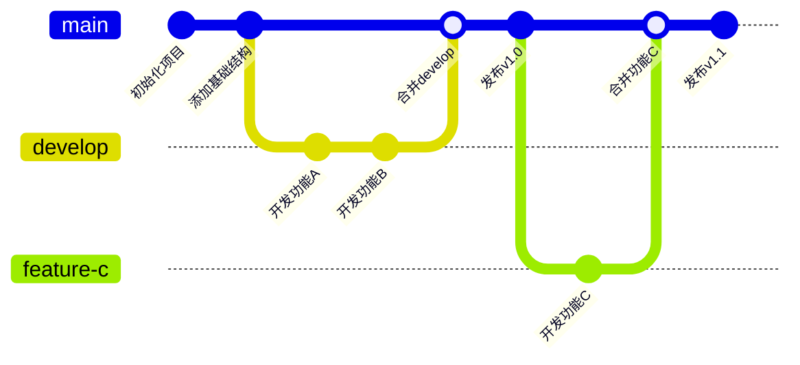
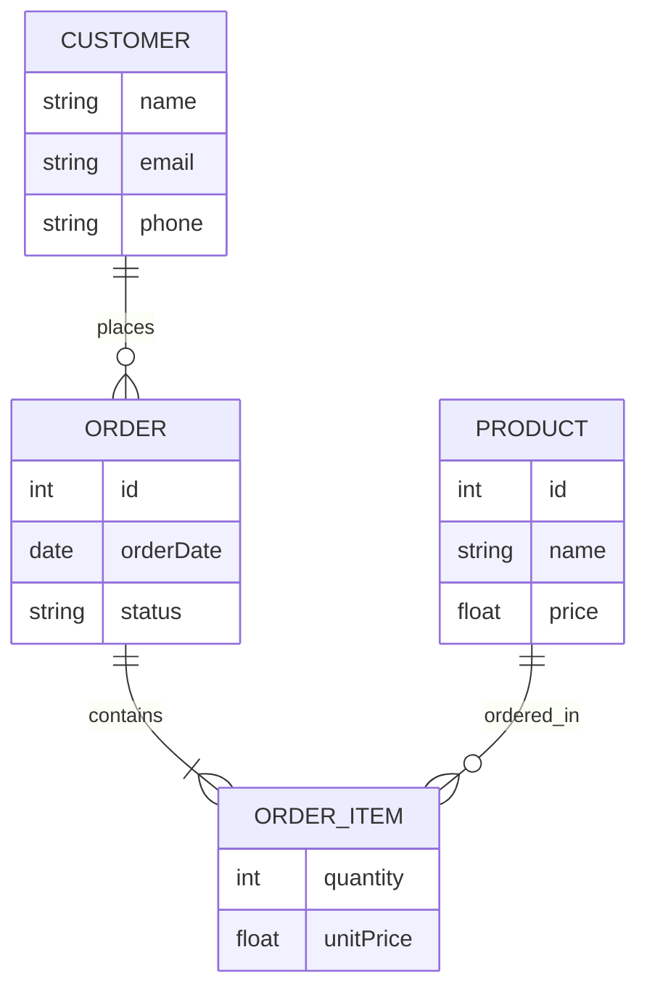

# Mermaid 图表类型综合示例

本文件汇总了 tests 目录中所有不同格式的 Mermaid 图表示例，用于对比不同插件的渲染效果。

---

## 1. Graph (基础图)

来源：[test-graph.mmd](./test-graph.mmd)



---

## 2. Flowchart (流程图)

来源：[test-flowchart.mmd](./test-flowchart.mmd)



---

## 3. Sequence Diagram (时序图)

来源：[test-sequence.mmd](./test-sequence.mmd)



---

## 4. Class Diagram (类图)

来源：[test-class.mmd](./test-class.mmd)



---

## 5. State Diagram (状态图)

来源：[test-state.mmd](./test-state.mmd)



---

## 6. Gantt Chart (甘特图)

来源：[test-gantt.mmd](./test-gantt.mmd)



---

## 7. Pie Chart (饼图)

来源：[test-pie.mmd](./test-pie.mmd)



---

## 8. User Journey (用户旅程图)

来源：[test-journey.mmd](./test-journey.mmd)



---

## 9. Git Graph (Git 提交历史图)

来源：[test-gitgraph.mmd](./test-gitgraph.mmd)



---

## 10. ER Diagram (实体关系图)

来源：[test-er.mmd](./test-er.mmd)



---

## 11. Requirement Diagram (需求图)

来源：[test-requirement.mmd](./test-requirement.mmd)

> **注意**: `requirementDiagram` 语法需要 Mermaid 11+ 版本。当前项目使用 Mermaid 10.6.0，此图表可能无法正确渲染。

```mermaid
requirementDiagram
    requirement 用户登录 {
        id: REQ-001
        desc: 用户可以通过用户名和密码登录系统
        risk: high
        verifymethod: test
    }
    
    requirement 密码加密 {
        id: REQ-002
        desc: 用户密码必须加密存储
        risk: critical
        verifymethod: inspection
    }
    
    requirement 会话管理 {
        id: REQ-003
        desc: 系统需要管理用户会话
        risk: medium
        verifymethod: test
    }
    
    functionalRequirement JWT令牌 {
        id: FR-001
        desc: 使用JWT进行身份验证
        risk: high
        verifymethod: test
    }
    
    用户登录 - satisfies -> JWT令牌
    密码加密 - refines -> 用户登录
    会话管理 - contains -> JWT令牌
```

---

## 12. Architecture Diagram (架构图)

来源：[test-architecture.mmd](./test-architecture.mmd)

> **注意**: `architecture-beta` 语法需要 Mermaid 11+ 版本。当前项目使用 Mermaid 10.6.0，此图表可能无法正确渲染。


---

## 使用说明

### 在 VS Code 中查看

1. 安装支持 Mermaid 预览的扩展（如 "Mermaid Preview"）
2. 打开此文件
3. 每个代码块都会自动渲染为对应的图表

### 对比不同插件的渲染效果

此文件包含所有主要的 Mermaid 图表类型，可以用于：
- 测试不同 VS Code 扩展的渲染能力
- 验证语法兼容性
- 对比渲染质量和样式
- 检查对各图表类型的支持程度

### 相关文件

- [README.md](./README.md) - 测试文件详细说明
- [TESTING.md](./TESTING.md) - 完整测试清单
- [SUMMARY.md](./SUMMARY.md) - 工作总结
- [QUICK_REFERENCE.md](./QUICK_REFERENCE.md) - 快速参考

---

**总计：12 种图表类型**

所有示例均来自 `tests/` 目录中的独立测试文件，确保语法的准确性和完整性。
